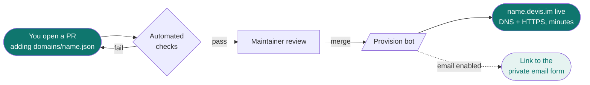

<div align="center">


# denizens

**The public registry for [devis.im](https://devis.im)** — claim your own
`name.devis.im` subdomain **and** an optional `name@devis.im` email alias,
free, by opening a pull request.

[](./LICENSE)
[](./CONTRIBUTING.md)


</div>

> A *denizen* is an inhabitant of a place. Claim your name and you're a denizen of devis.im.

---

## ✨ What you get

One name gives you **one identity** on devis.im — the subdomain and the email alias share it.

| | What | Where it goes |
| :-: | --- | --- |
| 🌐 | **`yourname.devis.im`** | A subdomain pointed wherever you like — GitHub Pages, Vercel, Netlify, a raw server, or a redirect. **HTTPS automatic.** |
| ✉️ | **`yourname@devis.im`** *(optional)* | An email alias that **forwards to your real inbox**. People email the alias; it lands privately — your real address is never exposed. |

> Claim `rajan` → both `rajan.devis.im` and `rajan@devis.im` are yours.

---

## 🌐 How a claim works



1. **Open a pull request** adding one file: `domains/yourname.json`.
2. **Automated checks run** on your file — fix anything they flag.
3. **A maintainer reviews.** If the name is free and the request looks fine, it's merged.
4. **On merge, automation provisions your subdomain** — DNS record + HTTPS within minutes.
5. **Asked for email?** You get a link to privately add your forwarding address.

---

## ✉️ How email forwarding works

Email is **opt-in** (`"email": { "enabled": true }`) and your real address is **never** in the repo.

```mermaid
flowchart TD
    A([Claim merged with<br/>email.enabled: true]) --> B[Open the private form<br/>claim.devis.im]
    B --> C{Verify with GitHub}
    C -- not your name --> X([Rejected])
    C -- you own it --> D[Submit forwarding address<br/>behind Turnstile]
    D --> E[Cloudflare emails that<br/>inbox a verification link]
    E --> F([You click it])
    F --> G([name@devis.im → your inbox<br/>forwarding live])
    style A fill:#0f766e,color:#fff
    style G fill:#0f766e,color:#fff
    style X fill:#fdeaea,color:#8a1f1f
```

**Why your forwarding address is *not* in the pull request** — this repo is **public**;
anything in your file and its git history is visible forever. The whole point of
`yourname@devis.im` is to *hide* your real address, so:

- The public file only carries `email.enabled: true|false`.
- After merge you submit the real address through a **private form** ([`claim.devis.im`](https://claim.devis.im)).
- You **verify with GitHub** there — proving the name is yours, so nobody can point *your* alias at *their* inbox.
- Cloudflare sends a **verification link** to your inbox; you click it; forwarding goes live.
- The registry **stores nothing** — your address lives only in Cloudflare's verified-destination system.

---

## Claiming a name

New to pull requests? Follow the slow, no-assumptions walkthrough in
[**Your first claim, step by step**](./docs/good-first-claim.md). The short version:

1. **Fork** this repository.
2. **Create** `domains/<yourname>.json`. The filename *is* the name you're claiming — `rajan.json` claims `rajan.devis.im` and `rajan@devis.im`. Lowercase letters, numbers, and hyphens only.
3. **Fill it in** using the format below. Keep `"$schema": "../schema.json"` at the top so your editor validates as you type.
4. **Set `owner.github`** to your own GitHub username — it must match the PR author.
5. **Open a pull request.** Automated checks run; fix anything they flag.
6. **Wait for review.** On merge, your subdomain is set up automatically.

---

## 📄 File format

```json
{
  "$schema": "../schema.json",
  "owner": {
    "github": "your-github-username"
  },
  "record": {
    "CNAME": "your-github-username.github.io"
  },
  "email": {
    "enabled": true
  }
}
```

| Field | Required | Description |
| --- | :-: | --- |
| `owner.github` | ✅ | Your GitHub username. Must match the PR author. |
| `owner.email` | — | A *public* contact email. **Never** your private forwarding address. |
| `record` | ✅ | Where the subdomain points (see record types below). |
| `email.enabled` | — | `true` if you also want `name@devis.im` forwarding. Omit for subdomain only. |
| `proxied` | — | Route through Cloudflare's proxy. Defaults to `false`. |

### Record types

Pick whichever fits how your site is hosted. Use `CNAME` **or** `A`/`AAAA`, not both.

| Type | Value | Use for |
| --- | --- | --- |
| `CNAME` | a single hostname | GitHub Pages, Vercel, Netlify, most hosts |
| `A` | array of IPv4 addresses | a raw server with an IPv4 address |
| `AAAA` | array of IPv6 addresses | a raw server with an IPv6 address |
| `TXT` | a string or array of strings | verification records, etc. |
| `URL` | a URL | redirect the subdomain elsewhere |

---

## 🔒 Reserved names

Some names can't be claimed — DNS infrastructure (`www`, `ns1`, `mail`…), email role
addresses (`abuse`, `postmaster`, `admin`, `security`, `dmarc`…), and a handful of
reserved service words. The full list is in [`reserved.json`](./reserved.json). These stay
with devis.im so system mail and abuse reports always reach the operators, never a third party.

---

## ⏱️ After your name goes live

| | When it's live |
| --- | --- |
| 🌐 **Subdomain** | Within minutes of merge — HTTPS included. |
| ✉️ **Email** | Once you submit your forwarding address through the private form, verify with GitHub, and click the link Cloudflare emails your inbox. That click is required and only you can do it — it also proves you control the destination inbox. |

> **Parked names don't resolve.** There's no wildcard DNS — an unclaimed `name.devis.im`
> returns NXDOMAIN. A name is live only once its claim is merged.

---

## ♻️ Changing or removing your name

Fire-and-forget — there's no dashboard:

- **Change** where your subdomain points, or your forwarding target → open a new PR editing your file.
- **Release** a name → delete your file in a PR.

---

## 🛑 Abuse

Subdomains or aliases used for phishing, malware, spam, or impersonation are removed without
notice. Report abuse to [`abuse@devis.im`](mailto:abuse@devis.im). See the operator runbook in
[`docs/abuse-triage.md`](./docs/abuse-triage.md).

---

## 📜 License

[MIT](./LICENSE) © Rajan Bhattarai
