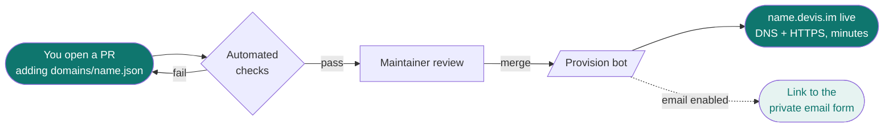
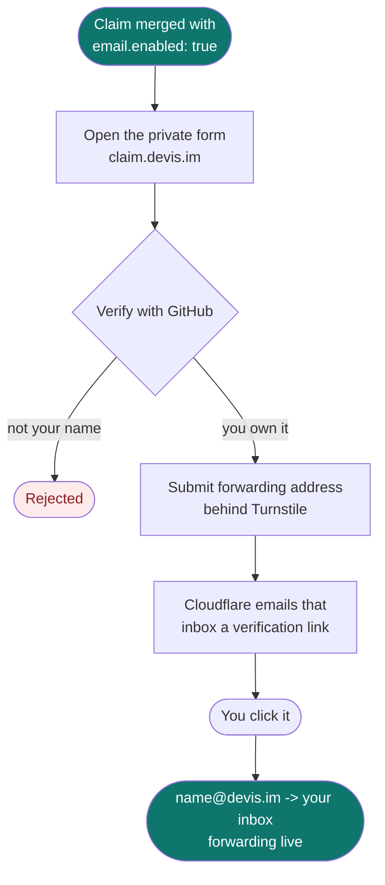

<div align="center">


# denizens

**The public registry for [devis.im](https://devis.im)** — claim your own
`name.devis.im` subdomain **and** an optional `name@devis.im` email alias,
free, by opening a pull request.

[](https://github.com/cdrrazan/denizens/actions/workflows/test.yml)
[](./LICENSE)
[](./CONTRIBUTING.md)


</div>

> A *denizen* is an inhabitant of a place. Claim your name and you're a denizen of devis.im.

---

## ✨ What you get

One name gives you **one identity** on devis.im — the subdomain and the email alias share it.

| | What | Where it goes |
| :-: | --- | --- |
| 🌐 | **`yourname.devis.im`** | A subdomain pointed wherever you like — GitHub Pages, Vercel, Netlify, a raw server, or a redirect. **HTTPS automatic.** |
| ✉️ | **`yourname@devis.im`** *(optional)* | An email alias that **forwards to your real inbox**. People email the alias; it lands privately — your real address is never exposed. |

> Claim `rajan` → both `rajan.devis.im` and `rajan@devis.im` are yours.

---

## 🌐 How a claim works


```mermaid
flowchart LR
    A(["You open a PR<br/>adding domains/name.json"]) --> B{"Automated<br/>checks"}
    B -- fail --> A
    B -- pass --> C["Maintainer review"]
    C -- merge --> D[/"Provision bot"/]
    D --> E(["name.devis.im live<br/>DNS + HTTPS, minutes"])
    D -. "email enabled" .-> F(["Link to the<br/>private email form"])
    style A fill:#0f766e,color:#fff
    style E fill:#0f766e,color:#fff
    style F fill:#e6f3f1,color:#0f766e
```

1. **Open a pull request** adding one file: `domains/yourname.json`.
2. **Automated checks run** on your file — fix anything they flag.
3. **A maintainer reviews.** If the name is free and the request looks fine, it's merged.
4. **On merge, automation provisions your subdomain** — DNS record + HTTPS within minutes.
5. **Asked for email?** A bot comments on your merged PR with a private link to add your forwarding address.

---

## ✉️ How email forwarding works

Email is **opt-in** (`"email": { "enabled": true }`) and your real address is **never** in the repo.


```mermaid
flowchart TD
    A(["Claim merged with<br/>email.enabled: true"]) --> B["Open the private form<br/>claim.devis.im"]
    B --> C{"Verify with GitHub"}
    C -- "not your name" --> X(["Rejected"])
    C -- "you own it" --> D["Submit forwarding address<br/>behind Turnstile"]
    D --> E["Cloudflare emails that<br/>inbox a verification link"]
    E --> F(["You click it"])
    F --> G(["name@devis.im -> your inbox<br/>forwarding live"])
    style A fill:#0f766e,color:#fff
    style G fill:#0f766e,color:#fff
    style X fill:#fdeaea,color:#8a1f1f
```

**Why your forwarding address is *not* in the pull request** — this repo is **public**;
anything in your file and its git history is visible forever. The whole point of
`yourname@devis.im` is to *hide* your real address, so:

- The public file only carries `email.enabled: true|false`.
- After merge, **a bot comments on your PR** with a private link to the form ([`claim.devis.im`](https://claim.devis.im), name prefilled).
- You **verify with GitHub** there — proving the name is yours, so nobody can point *your* alias at *their* inbox.
- Then you submit the real forwarding address (behind Turnstile).
- Cloudflare sends a **verification link** to your inbox; you click it; forwarding goes live.
- The registry **stores nothing** — your address lives only in Cloudflare's verified-destination system.

---

## Claiming a name

New to pull requests? Follow the slow, no-assumptions walkthrough in
[**Your first claim, step by step**](./docs/good-first-claim.md). The short version:

1. **Fork** this repository.
2. **Create** `domains/<yourname>.json`. The filename *is* the name you're claiming — `rajan.json` claims `rajan.devis.im` and `rajan@devis.im`. Lowercase letters, numbers, and hyphens only.
3. **Fill it in** using the format below. Keep `"$schema": "../schema.json"` at the top so your editor validates as you type.
4. **Set `owner.github`** to your own GitHub username — it must match the PR author.
5. **Open a pull request.** Automated checks run; fix anything they flag.
6. **Wait for review.** On merge, your subdomain is set up automatically.

---

## 📄 File format

```json
{
  "$schema": "../schema.json",
  "owner": {
    "github": "your-github-username"
  },
  "record": {
    "CNAME": "your-github-username.github.io"
  },
  "email": {
    "enabled": true
  }
}
```

| Field | Required | Description |
| --- | :-: | --- |
| `owner.github` | ✅ | Your GitHub username. Must match the PR author. |
| `owner.email` | — | A *public* contact email. **Never** your private forwarding address. |
| `record` | ✅ | Where the subdomain points (see record types below). |
| `email.enabled` | — | `true` if you also want `name@devis.im` forwarding. Omit for subdomain only. |
| `proxied` | — | Route through Cloudflare's proxy. Defaults to `false`. |

### Record types

Pick whichever fits how your site is hosted. Use `CNAME` **or** `A`/`AAAA`, not both.

| Type | Value | Use for |
| --- | --- | --- |
| `CNAME` | a single hostname | GitHub Pages, Vercel, Netlify, most hosts |
| `A` | array of IPv4 addresses | a raw server with an IPv4 address |
| `AAAA` | array of IPv6 addresses | a raw server with an IPv6 address |
| `TXT` | a string or array of strings | verification records, etc. |
| `URL` | a URL | redirect the subdomain elsewhere — **not supported yet** (claims using it are rejected) |

Validation rejects, with a clear message: a `CNAME` set to an IP (use `A`/`AAAA`),
`A`/`AAAA` addresses that aren't **public** (no loopback, private, link-local, or
multicast), empty record blocks, and the wrong IP family for the type.

---

## 🔒 Reserved names

Some names can't be claimed — DNS infrastructure (`www`, `ns1`, `mail`…), email role
addresses (`abuse`, `postmaster`, `admin`, `security`, `dmarc`…), and a handful of
reserved service words. The full list is in [`reserved.json`](./reserved.json). These stay
with devis.im so system mail and abuse reports always reach the operators, never a third party.

**One person, up to 2 names.** Each GitHub account can hold at most 2 claims — release one (delete its file in a PR) to free a slot.

---

## ⏱️ After your name goes live

| | When it's live |
| --- | --- |
| 🌐 **Subdomain** | Within minutes of merge — HTTPS included. |
| ✉️ **Email** | Once you submit your forwarding address through the private form, verify with GitHub, and click the link Cloudflare emails your inbox. That click is required and only you can do it — it also proves you control the destination inbox. |

> **Parked names don't resolve.** There's no wildcard DNS — an unclaimed `name.devis.im`
> returns NXDOMAIN. A name is live only once its claim is merged.

---

## ♻️ Changing or removing your name

Fire-and-forget — there's no dashboard:

- **Change** where your subdomain points, or your forwarding target → open a new PR editing your file.
- **Release** a name → delete your file in a PR. On merge, automation tears down the DNS record + email routing rule, and the name returns to the pool. This also frees a slot against the 2-name cap.

> At the 2-name cap and want a different name? Release first, then claim — they're **two separate PRs** (one file per PR), so the delete must merge before the new claim passes.

---

## 🛑 Abuse

Subdomains or aliases used for phishing, malware, spam, or impersonation are removed without
notice. Report abuse to [`abuse@devis.im`](mailto:abuse@devis.im). See the operator runbook in
[`docs/abuse-triage.md`](./docs/abuse-triage.md).

Security vulnerabilities go through a private channel instead — see [`SECURITY.md`](./SECURITY.md).

---

## ⚙️ How the automation works

No dashboard, no database. The repository *is* the state, and four pieces of automation act on it.

| When | What runs | What it does |
| --- | --- | --- |
| Pull request | [`validate.yml`](./.github/workflows/validate.yml) → [`scripts/validate-claim.rb`](./scripts/validate-claim.rb) | Validates your file against [`schema.json`](./schema.json) plus the policy rules the schema can't express — one file per PR, filename matches the claimed name, name free and not reserved, `owner.github` equals the PR author, per-owner cap, record sanity. Posts a single pass/fail comment, updated in place on every push. |
| Merge to `main` | [`provision.yml`](./.github/workflows/provision.yml) → [`scripts/provision.rb`](./scripts/provision.rb) | Diffs added/changed/deleted `domains/*.json` and applies them to Cloudflare **idempotently** — creates or updates DNS records, tears them down (plus any routing rule) on delete, and comments the private email-form link when `email.enabled`. One bad file never breaks the batch. |
| Email setup | [`worker/`](./worker) (Cloudflare Worker + Pages form) | The private intake at [`claim.devis.im`](https://claim.devis.im): GitHub sign-in proves the name is yours, Turnstile blocks bots, then it creates the verified destination address + routing rule. Stores nothing. |
| Weekly cron | [`blocklist.yml`](./.github/workflows/blocklist.yml) → [`scripts/blocklist-check.rb`](./scripts/blocklist-check.rb) | Checks devis.im against Spamhaus DBL / SURBL / URIBL and opens a tracking issue on a real listing. Resolver-blocked answers are reported *unknown*, never a false hit. |

Two rules hold the whole design together: **your forwarding address never touches this repo**, and
**every provisioning step is idempotent** — re-running on the same name updates, never duplicates.

### Repo layout

```
domains/          one JSON file per claimed name (example.json is a template)
schema.json       the contract every claim validates against
reserved.json     names that can't be claimed
scripts/          Ruby automation — validate, provision, blocklist check
spec/             RSpec suite for those scripts
.github/          workflows, issue + PR templates, CODEOWNERS
worker/           TypeScript Cloudflare Worker + the private email form
site/             static landing page for the apex devis.im
docs/             operator runbooks + the newcomer claim walkthrough
```

### Running it locally

Only needed if you're changing the automation — claiming a name needs nothing installed.

```sh
bundle install          # Ruby side
bundle exec rspec       # validator, provisioner, blocklist specs

cd worker && npm install && npm test    # Worker specs (vitest)
```

Ruby scripts are classes (`Validator`, `Provisioner`) with a guarded CLI entrypoint. Change behaviour,
change the spec. Secrets live in GitHub Secrets and Worker env vars — never in a tracked file.

---

## 📈 Status

Registry, validation, provisioning, the email Worker, and the landing page are all shipped and running.
Known gaps, so nothing surprises you:

- **`URL` records aren't supported yet** — claims using one are rejected rather than merged into a dead name. Redirect support is a follow-up.
- **Wildcard/parked names return NXDOMAIN by design.** No interstitial page.
- **Forward-only email.** No mailboxes; you can't *send* as `name@devis.im`.
- **DMARC is ramping** through `none` → `quarantine` → `reject`, per [`docs/email-reputation.md`](./docs/email-reputation.md).

Sequencing and what's left lives in [`ROADMAP.md`](./ROADMAP.md).

---

## 💬 Contact

| For | Where |
| --- | --- |
| Claim help, bugs, ideas | [Open an issue](https://github.com/cdrrazan/denizens/issues) — templates exist for claim help, abuse reports, and name releases |
| Abuse | [`abuse@devis.im`](mailto:abuse@devis.im) |
| Security | Private advisory, see [`SECURITY.md`](./SECURITY.md) |
| Anything else | [`irajanbhattarai@gmail.com`](mailto:irajanbhattarai@gmail.com) |

---

## 💛 Supporting devis.im

Names are free and stay free. The domain renewal and operator time aren't — if devis.im is
useful to you, [`FUNDING.md`](./FUNDING.md) explains what support covers and what it deliberately
doesn't buy (no paid tiers, no priority claims, no reserved-name sales).

---

## 📜 License

[MIT](./LICENSE) © Rajan Bhattarai
